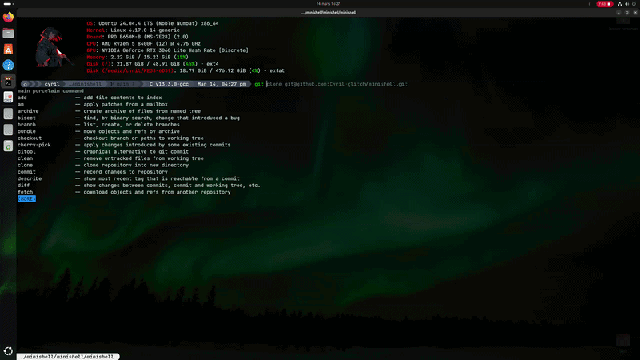

*This project has been created as part of the 42 curriculum by cycolonn, mtagand.*

# 🐚 Minishell - Technical Documentation

## 1. Description
**Minishell** is a minimalist implementation of a Unix shell, designed to replicate the core behavior of **Bash**. This project focuses on the fundamental interaction between the user and the kernel, specifically handling the lifecycle of processes and the management of file descriptors.

<p align="center">
  
</p>

---

<br />

## 2. Technical Instructions & Features
The shell is built to handle the mandatory requirements of the 42 curriculum:

---

<br />

* **Execution Pipeline**: Supports complex commands with multiple pipes (`|`), connecting processes via `pipe()` and `dup2()`.
* **Redirections**: Full support for input (`<`), output (`>`), append (`>>`), and Here-doc (`<<`).
* **Built-in Commands**: Native implementations of `echo -n`, `cd`, `pwd`, `export`, `unset`, `env`, and `exit`.
* **Environment Handling**: Dynamic expansion of environment variables (`$VAR`) and the exit status variable (`$?`).
* **Signal Management**: Intercepts `Ctrl-C`, `Ctrl-D`, and `Ctrl-\` to match Bash's interactive behavior.

---

<br />

## 3. Resources & Technical Choices
Our implementation follows specific technical decisions to satisfy the subject's constraints:

---

<br />

### 🧠 Centralized Memory Management (The `t_data` Structure)
* **Unified Data Access**: We chose to implement a "Super Structure" (typically named `t_data`) that holds all essential pointers (environment, command lists, token lists).
* **Leak Prevention**: This architecture ensures that all heap-allocated memory can be systematically freed from a single point of exit. 
* **Safe Exits**: Whether the shell exits normally or encounters a fatal error, the centralized structure allows for a clean cleanup process, fulfilling the strict "no memory leak" policy of the school.

---

<br />

### 📡 Signal Handling Strategy
* **Single Global Variable**: As mandated, we use exactly one global variable to communicate with signal handlers, ensuring no direct access to main data structures.
* **Choice of sigaction**: We opted for `sigaction` over `signal` for more reliable behavior and better management of signal masks.
* **Atomic Updates**: The global variable only stores the signal number, keeping the handler lightweight and safe.

---

<br />

### 🚦 Process Control & Exit Codes
* **The fork/execve Lifecycle**: Every command is executed in a child process created via `fork()`The parent waits for completion using `waitpid()` to capture the status.
* **Strict Error Codes**: We implemented standard POSIX exit codes to match Bash behavior:
    * **127**: Command not found or invalid path.
    * **126**: Command found but lacks execution permissions.
    * **1**: General errors (e.g., failed redirections).
    * **2**: Syntax errors (e.g., unexpected tokens). 
    
---

<br />

### 📜 Authorized Functions
This project is built strictly using authorized system calls, including `readline` for history management, `pipe` for inter-process communication, and `execve` for execution.

---

<br />

## 💻 How to Compile and Run
To compile and start the shell, use the following commands:

---

<br />

```bash
# Clone the repo
https://github.com/Cyril-glitch/minishell.git

# Compile the project
cd minishell
make

# Run the shell
./minishell
